# Formative 2 report: vaccine-tweet stance classification

## Abstract

We compare five approaches for classifying vaccine-related tweets as anti-vaccine (−1), neutral (0) or pro-vaccine (1) on a shared stratified split of 9556 labelled tweets (6689 / 1433 / 1434 for train / validation / test, seed 42). The models are TF-IDF with logistic regression, supervised fastText, a BiLSTM with GloVe-Twitter embeddings, a Transformer encoder trained from scratch, and fine-tuned BERTweet. Selection uses validation macro-F1; we also report RMSE on a continuous score defined as the softmax-weighted expectation over labels {-1, 0, 1}. On the held-out test set, BERTweet reaches macro-F1 0.7368 and RMSE 0.5567, ahead of the other four models, which lie between macro-F1 0.6048 and 0.6551. A VADER lexicon side experiment shows that general sentiment is a weak proxy for vaccine stance on this validation split. Error analysis of the shared predictions finds a large set of tweets that all models get right, a smaller shared hard set, and performance that falls with annotator agreement.

## 1 Introduction

Public discussion of vaccines on social media mixes news, personal stories and advocacy. Automatic stance classification can support monitoring of that discussion, but short, noisy tweets and minority anti-vaccine labels make the task difficult. This project asks how far classical bag-of-n-grams models, neural models trained only on this corpus, and a tweet-pretrained transformer go on the same fixed data and metrics.

We use the Zindi *To Vaccinate or Not to Vaccinate* dataset and a shared preprocessing and evaluation pipeline so that every model reads the same splits and writes predictions in the same format. The rest of the report describes related work named in our notebooks, the data and evaluation protocol, each model family, test results, error analysis, a VADER side experiment, limitations and conclusions.

## 2 Related work

Our baselines follow supervised fastText (Joulin et al., 2017) and standard TF-IDF logistic regression. The BiLSTM builds on bidirectional LSTMs (Hochreiter and Schmidhuber, 1997; Schuster and Paliwal, 1997) with GloVe-Twitter word vectors trained on about two billion tweets (Pennington et al., 2014). The from-scratch encoder follows the Transformer architecture (Vaswani et al., 2017) with a pre-LayerNorm variant (Xiong et al., 2020) and optional BPE subword tokens (Sennrich et al., 2016). Model 5 fine-tunes BERTweet (`vinai/bertweet-base`), a RoBERTa-style model pretrained on English tweets. The side experiment uses VADER, a rule-based social-media sentiment lexicon (Hutto and Gilbert, 2014). Full bibliographic details for these works are listed for completion in the References section.

## 3 Data and methodology

### 3.1 Dataset and exploratory analysis

The labelled training file provided by Zindi contains 10001 rows as read, including one tweet (`RQMQ0L2A`) split over two lines by a stray newline. After repair there are 10000 labelled tweets with class counts negative 1038 (10.38%), neutral 4908 (49.08%) and positive 4054 (40.54%), an imbalance ratio (max/min) of 4.73. Annotator agreement on the repaired labels has mean 0.854 and median 1.0; 41.3% of tweets have agreement below 0.7. Mean tweet length is 99.9 characters and 16.3 words (99th percentile 27 words). The vocabulary has 13840 types over 163282 tokens; 68.1% of types appear at most twice. Noise markers include `<user>` in 40.38% of tweets and `<url>` in 43.71%. Exact duplicate texts number 343; normalised duplicates 468, of which 44 pairs have conflicting labels. Negation cues appear in 23.4% of tweets.

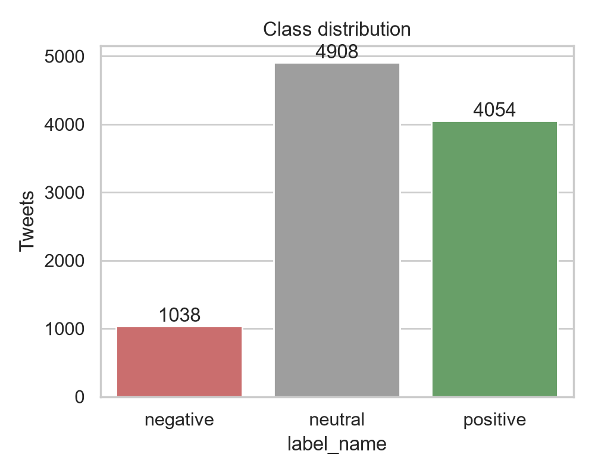

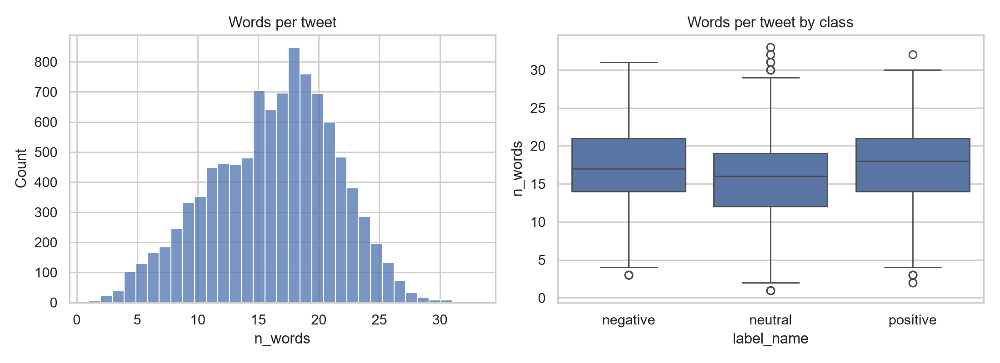

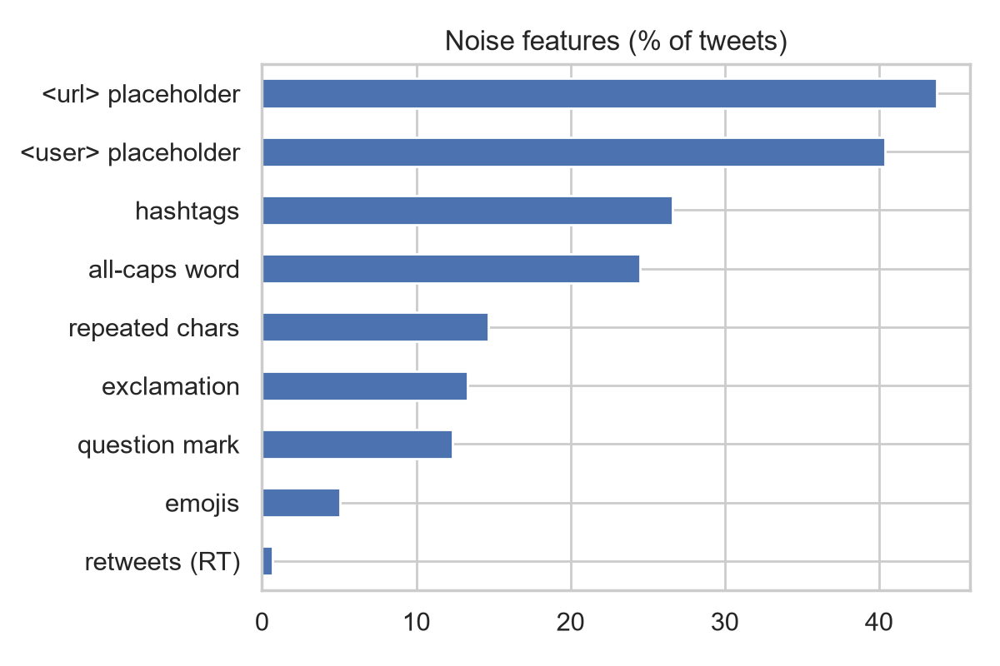

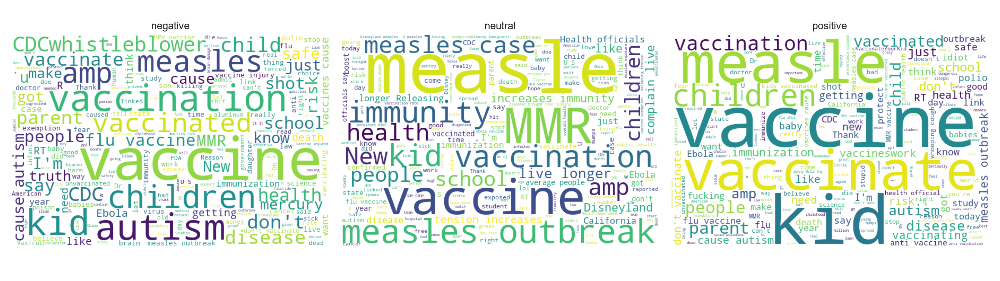

Shared cleaning (`src/preprocessing.py`) lowercases text, drops `<user>` / `<url>` tokens and raw URLs or mentions, demojizes emoji to words, strips leading `RT`, keeps `!` and `?`, and collapses long character repeats. The fixed split is stratified 70/15/15 by label with seed 42 after deduplication on cleaned text, yielding **6689 / 1433 / 1434** train / validation / test tweets (9556 total). Label shares on the processed split are about 10.6% negative, 48.3% neutral and 41.1% positive on train, with matching proportions on validation and test. Agreement on the test split takes values 1.0 (n=851), 0.667 (n=549) and 0.333 (n=34).

### 3.2 Evaluation protocol

Every model tunes on the validation split and is evaluated once on the test split through `src.evaluation.evaluate`. The primary selection metric is macro-F1 over labels {-1, 0, 1}. We also report RMSE between the gold label and a continuous score `y_score`. For probabilistic classifiers, `y_score` is the expected label under the predicted distribution, sum_k p_k * k for k in {-1, 0, 1} (softmax probabilities for neural models; the same construction for logistic regression and fastText as described in notebook 02 and `src/nn_utils.py`). Predictions are saved with columns `tweet_id`, `text`, `y_true`, `y_pred`, `y_score`, `agreement` for later comparison. Hyperparameter runs are appended to `reports/experiment_log.csv`.

### 3.3 Models 1–2: TF-IDF and fastText

**TF-IDF + logistic regression.** Features are word and/or character n-grams (`word12`, `char25`, `word+char`) with `min_df=2`. Experiment B1 compares raw `safe_text` and `clean_text` at C=1 with balanced class weights (validation macro-F1 0.6423 vs 0.6380). B2 grids features and C; the best validation setting is `word+char`, C=1.0, balanced weights (macro-F1 0.6590, RMSE 0.5875). B3 confirms balanced weights against none (0.6590 vs 0.6404 macro-F1; negative recall 0.5294 vs 0.2810). Ridge regression on the same features (B4) reaches much lower validation macro-F1 (best values in the log stay near 0.51) and is kept only as a contrast. A learning curve (B5) shows validation macro-F1 rising from 0.5849 at 10% of training data to 0.6590 at 100%.

**Final TF-IDF logistic regression:** `word+char` TF-IDF, C=1, balanced sample weights, trained on `clean_text`. Test: macro-F1 0.6551, RMSE 0.5838, accuracy 0.7183 (`reports/results.csv`).

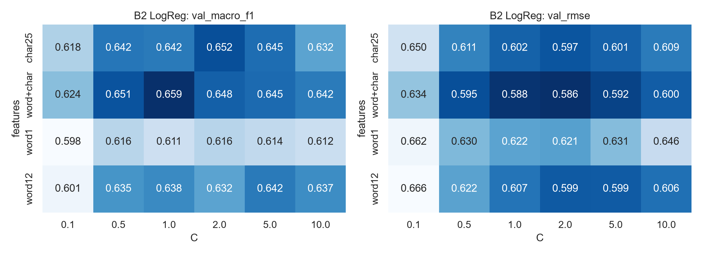

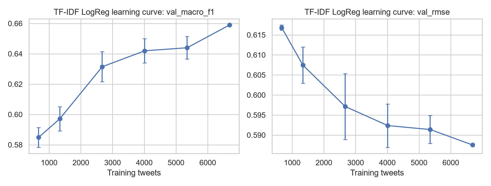

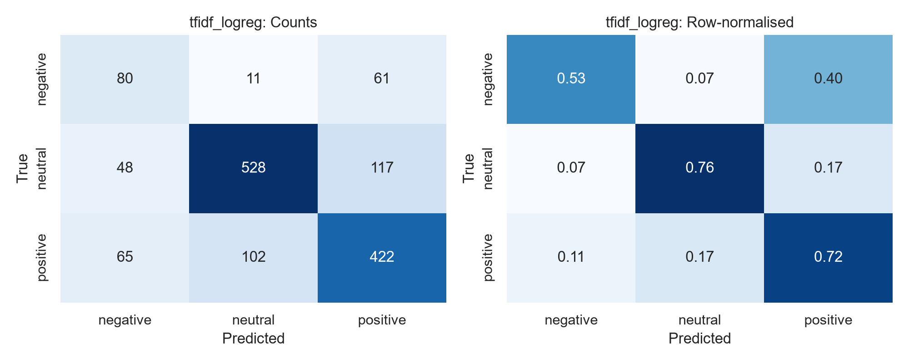

**fastText.** Supervised fastText with softmax loss and `minCount=2` (Joulin et al., 2017) is tuned over learning rate, epochs, word n-grams and dimension (F1). The best validation run in the log is lr=0.1, 25 epochs, wordNgrams=2, dim=50 (macro-F1 0.6367, RMSE 0.6046). An epoch sweep (F2) in the notebook shows training F1 saturating while validation F1 plateaus near 0.63.

**Final fastText:** that F1 winner retrained for the test evaluation. Test: macro-F1 0.6048, RMSE 0.6161, accuracy 0.7127.

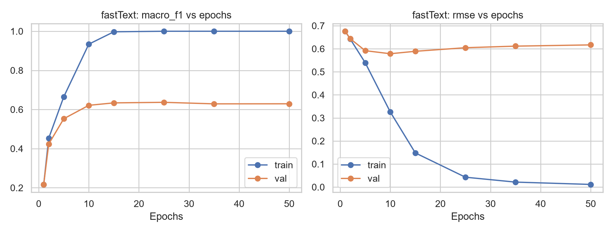

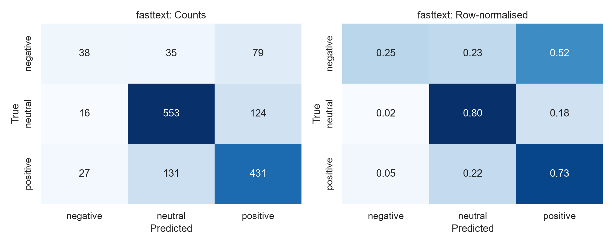

### 3.4 Models 3–4: BiLSTM and Transformer from scratch

**BiLSTM + GloVe-Twitter.** A bidirectional LSTM with attention or other pooling reads token sequences; embeddings can be random or GloVe-Twitter (Pennington et al., 2014). Experiments use three seeds per configuration:

| Exp | Question | Mean val macro-F1 (best setting) |
|---|---|---|
| L1 | Embeddings | Fine-tuned GloVe 0.6428 vs frozen 0.6077 vs random 0.6023 |
| L2 | Direction / pooling | BiLSTM + attention 0.6472 |
| L3 | Class weighting | Unweighted loss mean 0.6551 (three seeds in the log) |
| L4 | Hidden size / dropout | hidden 256, dropout 0.5 mean 0.6563 |
| L5 | GloVe dimension | dim 200 mean 0.6509; dim 50 mean 0.6317 (dim 100 carried from earlier winners) |

**Final BiLSTM** (notebook 03 seed-42 test run): fine-tuned GloVe dim 100, hidden 256, bidirectional, attention pooling, dropout 0.5, lr 0.001, unweighted loss. Test: macro-F1 0.6505, RMSE 0.5977, accuracy 0.7357.

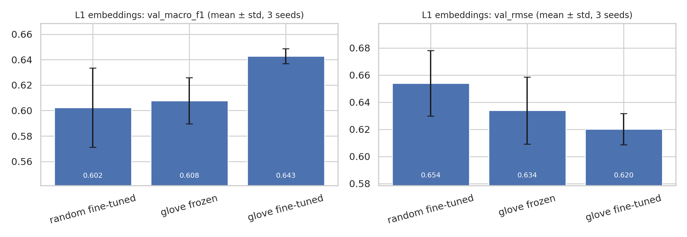

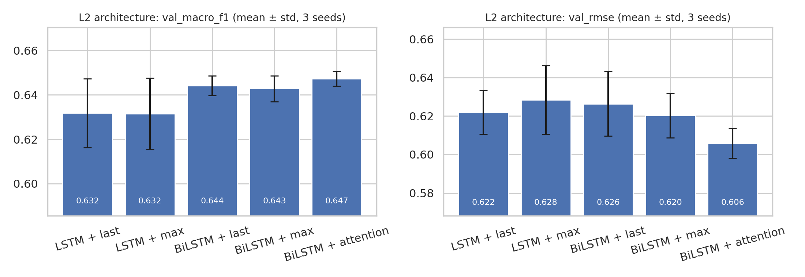

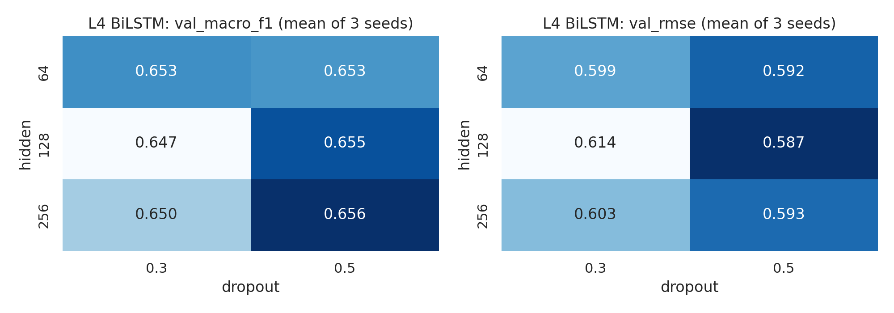

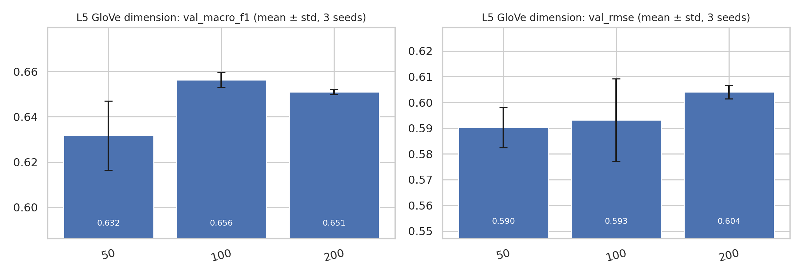

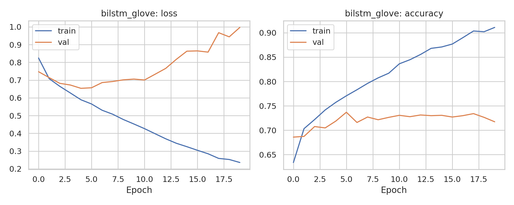

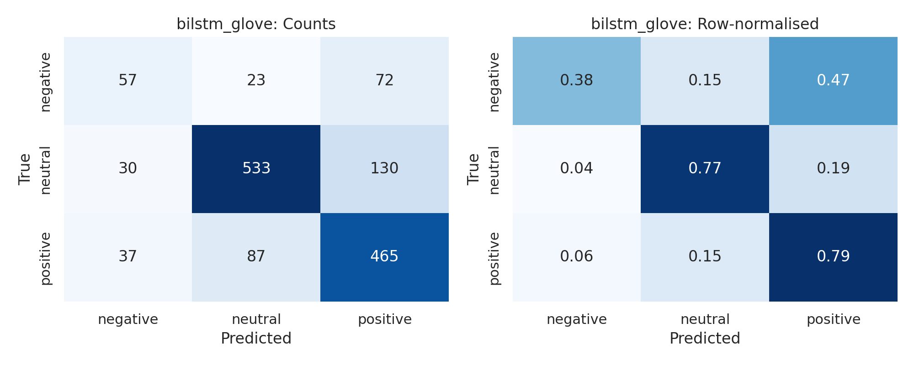

**Transformer encoder from scratch.** A small pre-LayerNorm encoder with padding masks is trained only on this corpus (Vaswani et al., 2017; Xiong et al., 2020). Three-seed means include:

| Exp | Question | Mean val macro-F1 (best setting) |
|---|---|---|
| T1 | Positional encoding | none 0.6084; sinusoidal 0.5968; learned 0.5918 |
| T2 | Depth / width | 1×128 mean 0.6039; 2×64 mean 0.5975; 1×64 mean 0.5897 (2×128 carried from T1 at 0.6084) |
| T3 | Word vs BPE | BPE 0.6046 (word baseline 0.6084) |
| T4 | GloVe vs random init | GloVe 0.6250 vs random 0.5952 at d_model 100 |
| T5 | Pooling / warmup | all four settings between 0.6238 and 0.6250 |

**Final Transformer** (notebook 04): word tokens, GloVe init, d_model 100, 2 layers, 4 heads, dropout 0.2, no positional encoding, CLS pooling, lr 5e-4, warmup 0.1. Test: macro-F1 0.6542, RMSE 0.6029, accuracy 0.7162.

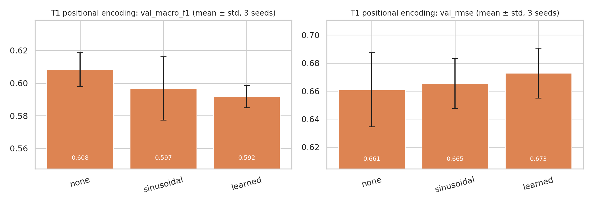

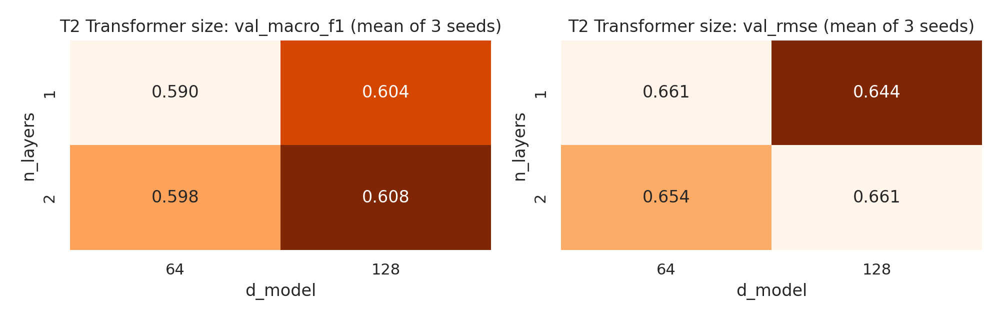

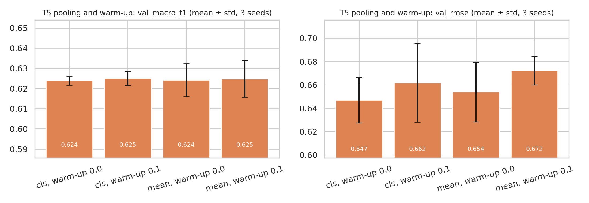

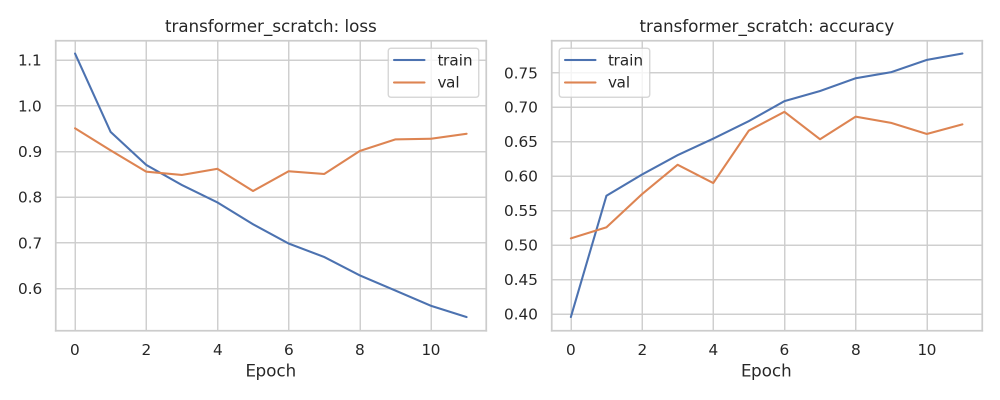

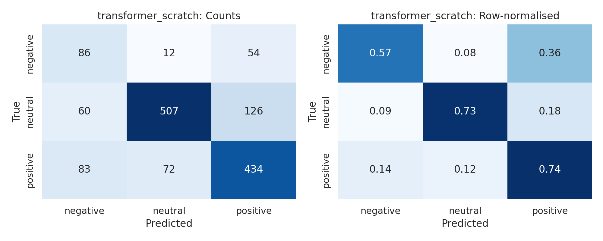

### 3.5 Model 5: BERTweet

### Method

Model 5 fine-tunes `vinai/bertweet-base` for three-way stance classification on the shared tweet split (train 6689, validation 1433, test 1434). Inputs use the raw `safe_text` field with `<user>` / `<url>` mapping for the tokenizer. Sequences are truncated or padded to length 80. A linear classification head produces logits over labels {-1, 0, 1}. Training uses AdamW with linear warmup (10% of steps) then decay, mixed precision on CUDA, gradient clipping at 1.0, batch size 16, up to 5 epochs, and early stopping on validation macro-F1 with patience 2. Each configuration is run with three seeds (42, 1, 2). Selection uses mean validation macro-F1; the seed-42 checkpoint of the chosen configuration is evaluated once on the test set. Method details are taken from `src/bert_utils.py` (`MAX_LEN = 80`, AdamW, warmup, amp, clip, patience) and notebook 06.

### Experiments (validation macro-F1, mean of three seeds)

Means below were recomputed from `reports/experiment_log.csv` for `model == "bertweet"`.

| Experiment | Setting | Seeds used | Mean val macro-F1 | Per-seed values |
|---|---|---|---|---|
| Text (E1, lr 2e-5, no class weights) | raw | 3 | 0.7274 | [0.7298, 0.7261, 0.7263] |
| Text (E1, lr 2e-5, no class weights) | clean | 3 | 0.7273 | [0.725, 0.7308, 0.7261] |
| Learning rate (raw; 2e-5 from E1, others from E2) | 1e-5 | 3 | 0.7105 | [0.7103, 0.712, 0.7092] |
| Learning rate | 2e-5 | 3 | 0.7274 | [0.7298, 0.7261, 0.7263] |
| Learning rate | 3e-5 | 3 | 0.7297 | [0.7145, 0.7387, 0.7359] |
| Class weights (E3 vs E2 at lr 3e-5) | off (E2) | 3 | 0.7297 | [0.7145, 0.7387, 0.7359] |
| Class weights | on (E3) | 3 | 0.7389 | [0.7432, 0.7359, 0.7376] |
| Frozen-encoder probe (E4; comparison only) | freeze, lr 0.001 | 3 | 0.5872 | [0.587, 0.5815, 0.5932] |

Raw and clean text are effectively tied at lr 2e-5 (0.7274 vs 0.7273); that text comparison was run only at lr 2e-5, not at the final 3e-5. Among learning rates on raw text, 3e-5 has the highest mean (0.7297). Turning on class weights at lr 3e-5 raises the mean from 0.7297 to 0.7389, a gain of about 0.009, which is comparable to the E3 seed std of 0.0038, so it is a small gain rather than a clear one. The frozen-encoder probe is much lower (0.5872) and is reported only as a comparison.

### Final configuration and test results

Final configuration: raw text, learning rate 3e-5, class weights on, encoder not frozen (E3). The seed-42 validation macro-F1 for that run is 0.7432 (`reports/experiment_log.csv`).

Test metrics for BERTweet from `reports/final_table.csv` (point estimates and 95% bootstrap intervals):

| Metric | Point | 95% CI |
|---|---|---|
| Macro-F1 | 0.7368 | [0.7074, 0.7629] |
| RMSE | 0.5567 | [0.5196, 0.5933] |
| Accuracy | 0.7908 | [0.7685, 0.8110] |
| F1 negative | 0.5811 | [0.5123, 0.6436] |
| F1 neutral | 0.8243 | [0.8009, 0.8457] |
| F1 positive | 0.8051 | [0.7786, 0.8293] |

These test numbers come from one seed-42 training run.

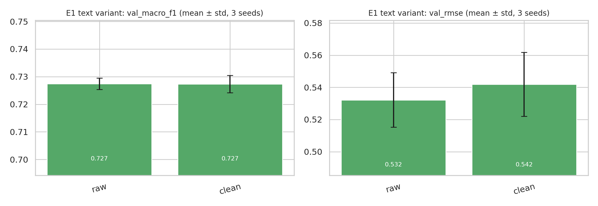

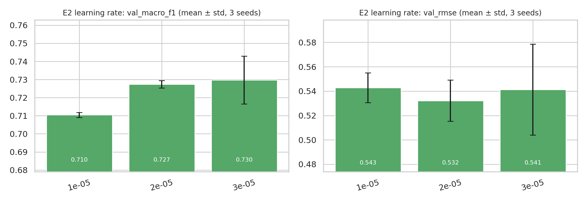

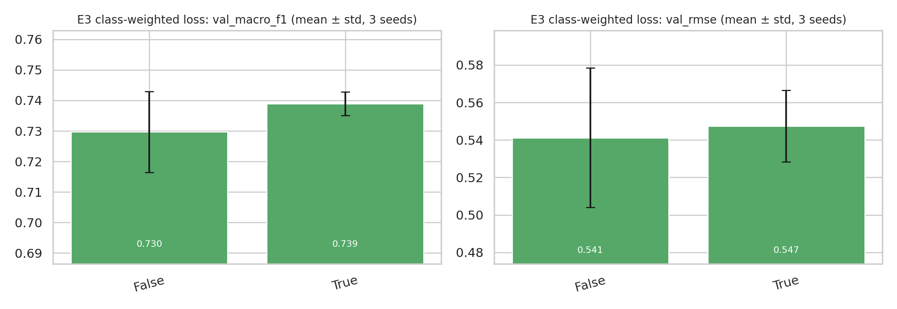

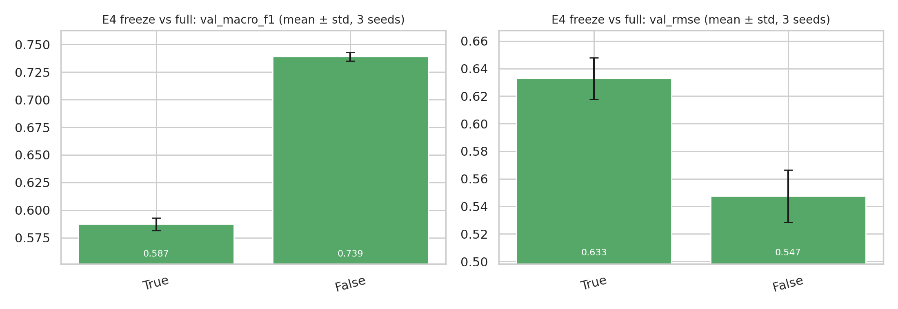

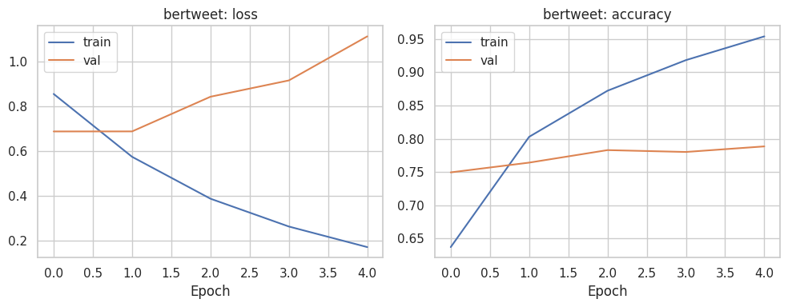

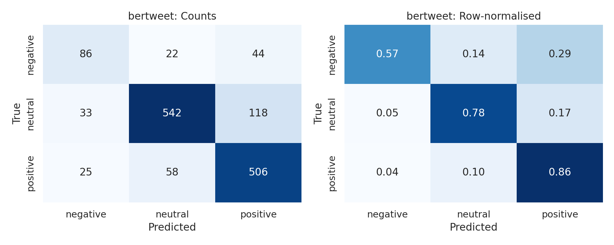

## 4 Results and comparison

Table 1 collects the five primary models on the shared test set. Point estimates match `reports/results.csv`; intervals are 95% bootstrap intervals from `reports/final_table.csv` (2000 resamples of the 1434 test tweets, seed 42).

| Model | Macro-F1 | Macro-F1 95% CI | RMSE | RMSE 95% CI | Acc. | F1− | F1 0 | F1+ |
|---|---|---|---|---|---|---|---|---|
| tfidf_logreg | 0.6551 | [0.6257, 0.6836] | 0.5838 | [0.5615, 0.6075] | 0.7183 | 0.4638 | 0.7916 | 0.7098 |
| fasttext | 0.6048 | [0.5745, 0.6360] | 0.6161 | [0.5857, 0.6480] | 0.7127 | 0.3262 | 0.7833 | 0.7048 |
| bilstm_glove | 0.6505 | [0.6188, 0.6793] | 0.5977 | [0.5659, 0.6297] | 0.7357 | 0.4130 | 0.7979 | 0.7404 |
| transformer_scratch | 0.6542 | [0.6245, 0.6817] | 0.6029 | [0.5743, 0.6312] | 0.7162 | 0.4514 | 0.7897 | 0.7215 |
| bertweet | 0.7368 | [0.7074, 0.7629] | 0.5567 | [0.5196, 0.5933] | 0.7908 | 0.5811 | 0.8243 | 0.8051 |

Point macro-F1 on the shared test set (`reports/final_table.csv`): BERTweet 0.7368, TF-IDF LogReg 0.6551, scratch transformer 0.6542, BiLSTM 0.6505, fastText 0.6048. All of these test numbers are from one seed per model. The four models with no pretrained transformer encoder span 0.6048 to 0.6551, about 0.05 macro-F1; the BiLSTM still uses GloVe-Twitter embeddings. Among TF-IDF LogReg, BiLSTM and the scratch transformer the gaps are smaller (within about 0.005).

Paired bootstrap of macro-F1(BERTweet) − macro-F1(other) on the test tweets (notebook 09, 2000 resamples, seed 42) gives mean differences 0.0817 vs LogReg, 0.1316 vs fastText, 0.0864 vs BiLSTM, and 0.0820 vs the scratch transformer; all four 95% intervals lie above zero (lower ends 0.0507, 0.0977, 0.0548, 0.0498) and share_le_0 = 0 in each case. Training variation is not included in that bootstrap (E3 validation macro-F1 std across three seeds is 0.0038).

The largest BERTweet gain relative to the others on the class-wise F1 table is on the negative class: 0.5811 against 0.3262–0.4638 for the other four models (`reports/final_table.csv`).

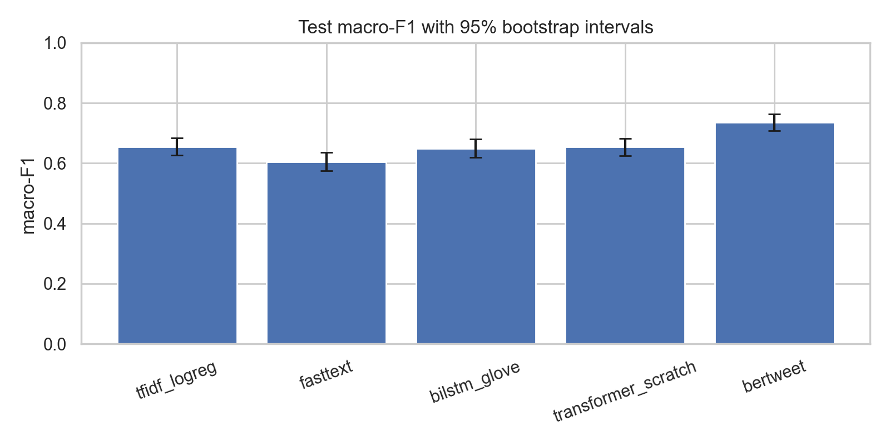

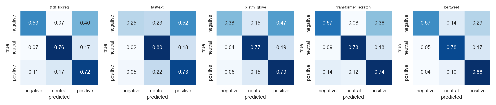

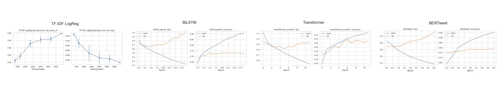

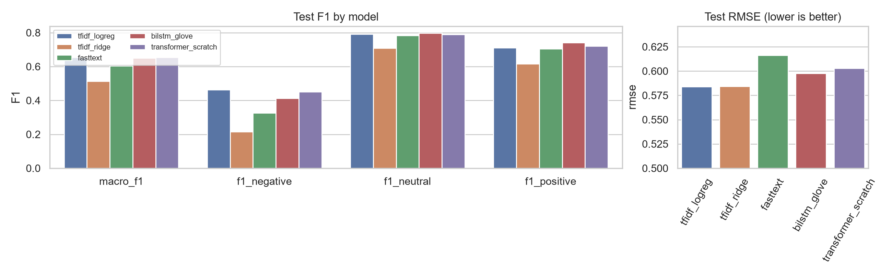

## 5 Error analysis

Using the five aligned test prediction files (`reports/predictions/*.csv`, n = 1434):

- All five models correct: 791 tweets.
- All five models wrong: 128 tweets.
- Mean number of models wrong per tweet: 1.3264.

### Annotator agreement

| Agreement | n | BERTweet macro-F1 | BiLSTM macro-F1 | TF-IDF LogReg macro-F1 |
|---|---|---|---|---|
| 1.0 | 851 | 0.8649 | 0.7554 | 0.7045 |
| 0.667 | 549 | 0.6096 | 0.5416 | 0.5622 |
| 0.333 | 34 | 0.1138 | 0.0702 | 0.1739 |

Performance falls as agreement falls. The 0.333 bin is only 34 tweets (2.4% of the test set), so those scores are noisy.

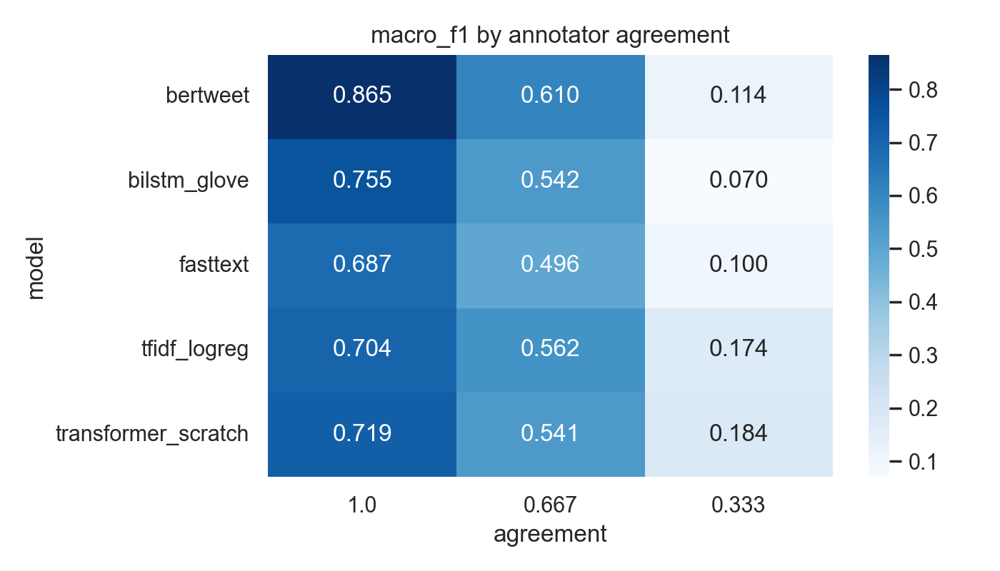

### Heuristic slices

Slice sizes on the test set: negation 366, sarcasm cues 182, news-style 406. These are keyword or pattern heuristics, not gold labels. The sarcasm-cue pattern is a broadened cue list; it is large enough to score (n = 182) but remains heuristic.

Macro-F1 on the negation slice is below each model's overall score. Drops (overall minus negation): TF-IDF LogReg 0.0423, fastText 0.0583, BiLSTM 0.0460, transformer 0.0405, BERTweet 0.0121. News-style macro-F1 values are 0.6644 / 0.5870 / 0.6520 / 0.6453 / 0.7252 for LogReg / fastText / BiLSTM / transformer / BERTweet.

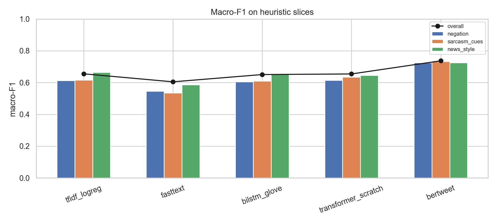

### BERTweet confusion (true negative class)

From the test predictions, among 152 true-negative tweets the row-normalised rates are: negative to neutral 0.1447, negative to positive 0.2895. The negative-to-positive rate is lower than for the other models (0.3553 to 0.5197). The negative-to-neutral rate is not lower than TF-IDF LogReg (0.0724) or the scratch transformer (0.0789); it is lower than fastText (0.2303) and similar to the BiLSTM (0.1513).

### Manual coding of 30 shared hard errors

Thirty tweets that all five models miss were sampled with seed 42 and coded by hand into five categories (illustrative counts, not population rates):

| Category | Count |
|---|---|
| other | 10 |
| sarcasm | 6 |
| news_style | 6 |
| ambiguous_label | 6 |
| negation | 2 |

Illustrative examples (shortened; no offensive wording):

1. ambiguous_label (TE40NOVB, y_true = 0): argues for vaccinating only those at risk rather than everyone; the neutral gold label is debatable.
2. news_style (RE4YLV4S, y_true = -1): AM-News headline about health conspiracy theories with a URL; news form with low agreement.
3. sarcasm (XLX3D9RE, y_true = -1): rhetorical challenge ("What's wrong with getting measles?") defending exemption.
4. negation (GIGS057L, y_true = 0): "there was no such thing as a chicken pox vaccine when we were kids".

### Limitations of the error analysis

Test predictions for each model are a single training seed. Several slices are small or pattern-based (especially agreement 0.333 with n = 34, and keyword sarcasm/negation detection). Only 30 all-wrong tweets were coded by hand; those counts are illustrative, not estimated rates. Label noise is visible at low agreement.

## 6 Side experiment (VADER)

On the validation split, VADER compound mapped with the standard ±0.05 thresholds (version A) reaches macro-F1 0.3242; a train-tuned threshold of 0.30 (version B) reaches 0.3444 (`reports/vader_val_results.csv`). RMSE of compound against the stance label is 0.8573; Spearman correlation is −0.0058 (p = 0.8254). Always predicting neutral scores 0.2171 macro-F1; a random predictor matched to validation class proportions averages 0.3330 over 500 draws with seed 42 (notebook 07). Version A is near that random reference; version B is only slightly above it. A lexicon sentiment score does not recover vaccine stance on this split. The words measles and outbreak are not in the VADER lexicon (a demo tweet about a measles outbreak scores compound 0.0); strongly negative compounds on pro-vaccine tweets are driven by lexicon words such as stupid, death, tragic and sick, while some anti-vaccine tweets score positive through words such as healthy, safe and good.

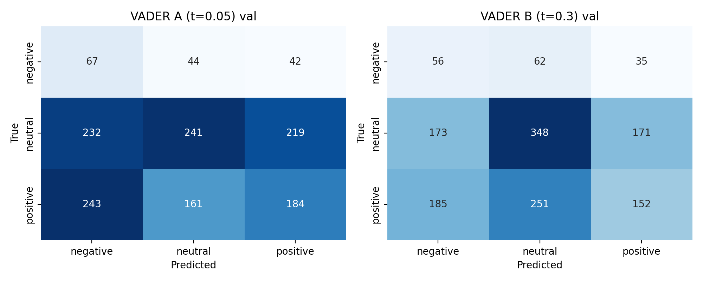

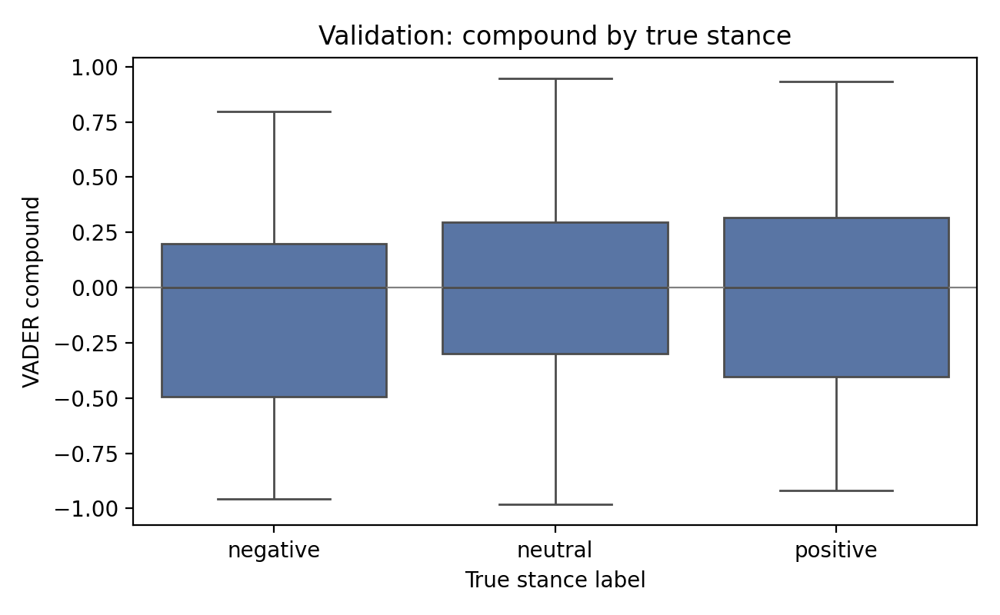

## 7 Discussion and limitations

Across Models 1–4, test macro-F1 stays within about 0.05 (0.6048–0.6551), and TF-IDF logistic regression, the BiLSTM and the scratch Transformer differ by at most 0.005. GloVe-Twitter helps both neural-from-scratch models when embeddings are adapted, but neither matches BERTweet. BERTweet’s largest class-wise gain is on the negative label. These comparisons use one test seed per model; training variance is only partly visible in validation seed standard deviations (for example 0.0038 for BERTweet E3).

Limitations include label noise at low agreement, heuristic error slices, a hand-coded sample of only 30 shared hard errors, single-seed test predictions, and compute differences (BERTweet uses a large pretrained encoder). The VADER experiment shows that off-the-shelf sentiment scores are near chance relative to stance on this validation split. We did not run a controlled ablation that trains the same transformer architecture from random initialisation versus tweet pretraining beyond the scratch Transformer and BERTweet pair already reported.

## 8 Conclusion

On the shared test set of 1434 tweets, BERTweet reaches macro-F1 0.7368 and RMSE 0.5567, ahead of TF-IDF LogReg (0.6551 / 0.5838), the scratch transformer (0.6542 / 0.6029), the BiLSTM (0.6505 / 0.5977) and fastText (0.6048 / 0.6161). Paired bootstrap differences of BERTweet against each other model stay positive, with lower interval ends about 0.05 or higher, though each test score is from one training seed. The clearest class-wise gain is on negatives (F1 0.5811 versus 0.3262 to 0.4638). Error analysis shows 791 tweets correct for all five models and 128 wrong for all five; performance falls with annotator agreement, and heuristic negation tweets cost every model some macro-F1. A thirty-tweet hand-coded sample of shared hard errors is illustrative only. VADER validation macro-F1 stays near a random-by-proportions reference (0.3242 to 0.3444 versus 0.3330), so lexicon sentiment does not stand in for stance here. Models with no pretrained transformer encoder remain within about 0.05 macro-F1 of each other, while the BiLSTM still uses GloVe-Twitter embeddings; tweet-level pretraining is associated with the strongest result on this split.

## References

Works named in the README and notebooks (bibliographic details incomplete in the repo):

1. Joulin et al. (2017). Bag of Tricks for Efficient Text Classification (fastText). Cited in notebook 02.
2. Hochreiter and Schmidhuber (1997); Schuster and Paliwal (1997). LSTM / bidirectional RNN. Cited in notebook 03.
3. Pennington et al. (2014). GloVe: Global Vectors for Word Representation (GloVe-Twitter). Cited in notebook 03.
4. Vaswani et al. (2017). Attention Is All You Need. Cited in notebook 04.
5. Xiong et al. (2020). Pre-LayerNorm Transformer variant. Cited in notebook 04.
6. Sennrich et al. (2016). Neural Machine Translation of Rare Words with Subword Units (BPE). Cited in notebook 04.
7. BERTweet / `vinai/bertweet-base` (Nguyen et al., VinAI). Used in notebook 06 and `src/bert_utils.py`.
8. Hutto and Gilbert (2014). VADER. Cited in notebook 07.
9. Zindi. To Vaccinate or Not to Vaccinate competition dataset. Linked from README.md.

## Appendix: Numbers used

| Number | Value | Source |
|---|---|---|
| Train / val / test sizes | 6689 / 1433 / 1434 | `data/processed/*.csv` |
| Raw labelled rows after repair | 10000 | notebook 01 outputs |
| Class counts neg/neu/pos (pre-split) | 1038 / 4908 / 4054 | notebook 01 |
| Imbalance ratio | 4.73 | notebook 01 |
| Agreement mean; share <0.7 | 0.854; 0.413 | notebook 01 |
| Mean words; 99th pct | 16.3; 27 | notebook 01 |
| Vocab; share types ≤2 | 13840; 68.1% | notebook 01 |
| `<user>` / `<url>` rates | 40.38% / 43.71% | notebook 01 |
| Exact / normalised dupes; conflicts | 343 / 468 / 44 | notebook 01 |
| Negation share | 23.4% | notebook 01 |
| B1 val F1 raw/clean | 0.6423 / 0.6380 | `experiment_log.csv` |
| B2/B3 best val F1 | 0.6590 | `experiment_log.csv` |
| B5 F1 at 10%/100% data | 0.5849 / 0.6590 | notebook 02 |
| fastText best val F1 | 0.6367 | `experiment_log.csv` |
| L1/L2/L4 best mean val F1 | 0.6428 / 0.6472 / 0.6563 | `experiment_log.csv` |
| T1 none / T4 GloVe mean val F1 | 0.6084 / 0.6250 | `experiment_log.csv` |
| E1–E4 BERTweet means | 0.7274 / 0.7297 / 0.7389 / 0.5872 | `experiment_log.csv` |
| Test macro-F1 five models | 0.6551, 0.6048, 0.6505, 0.6542, 0.7368 | `final_table.csv` / `results.csv` |
| Test RMSE five models | 0.5838, 0.6161, 0.5977, 0.6029, 0.5567 | same |
| All-correct / all-wrong / mean wrong | 791 / 128 / 1.3264 | predictions / notebook 08 |
| Agreement bin sizes | 851 / 549 / 34 | predictions |
| Slice sizes neg/sarc/news | 366 / 182 / 406 | predictions / analysis helpers |
| Negation F1 drops | 0.0423, 0.0583, 0.0460, 0.0405, 0.0121 | predictions |
| Manual coding counts | other 10, sarcasm 6, news_style 6, ambiguous_label 6, negation 2 | `error_sample_for_manual_coding.csv` |
| Paired BT mean diffs | 0.0817, 0.1316, 0.0864, 0.0820 | notebook 09 |
| VADER A/B val F1; RMSE; Spearman | 0.3242 / 0.3444; 0.8573; −0.0058 | `vader_val_results.csv` |
| Always-neutral / random mean F1 | 0.2171 / 0.3330 | notebook 07 |
| Ridge test macro-F1 (secondary) | 0.5139 | `results.csv` |
